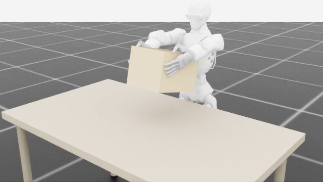
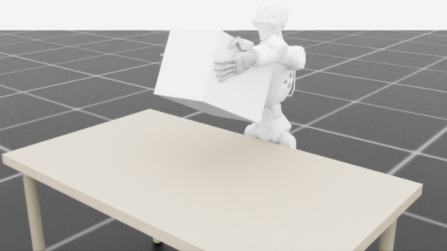

# R1-o6 双臂夹取箱体

用 Isaac Lab 验证 R1-o6 双臂从箱体两侧夹紧并抬升物体。目前支持中号瓦楞纸快递箱和 EPS 泡沫箱，这种双侧夹取方式对这两类物体均已验证有效。

[English version](README.en.md)

代码许可证：[Apache-2.0](LICENSE)

## 先看结果

下面是两类物体的成功运行最终帧。

| 中号快递箱 | EPS 泡沫箱 |
|:---:|:---:|
|  |  |

| 对象 | 基线 | 质量 | 尺寸 XYZ | 初始 X | 每手目标力 | 抬升命令 | 结果 |
|---|---|---:|---:|---:|---:|---:|---|
| `courier_box_m` | `rootback3cm-force10p5n-v41` | 1.0 kg | 0.30 x 0.22 x 0.20 m | 0.270 m | 10.5 N | 0.16 m | `done(status=lifted)` |
| `foam_box` | `flat-palm-v19` | 0.5 kg | 0.35 x 0.24 x 0.25 m | 0.295 m | 11.0 N | 0.20 m | `done(status=lifted)`；实测上升 0.1989 m |

两类对象的验证基线都使用 `robot_root_x_offset=-0.03 m` 和 `clamp_x_offset=-0.03 m`。成功判定同时看两个条件：服务端返回 `done(status=lifted)`，并且箱体实际抬升至少 0.15 m。泡沫箱在抬升末段会出现约 30-35 度旋转，这是当前实验中的已知现象。

## 项目内容

发送一次 `clamp` 命令后，程序会自动完成预抓、夹紧和抬升：

- 先收拢手指并侧向抬臂，再检查指尖与桌面的净空；
- 计算箱体两侧的预抓位姿和夹紧位姿；
- 读取只统计箱体接触的触觉通道，按夹持方向的法向力调节夹紧量；
- 等待左右手都建立稳定接触，再协调抬升；
- 根据接触状态和箱体位移返回成功或保护性失败。

主要入口：

- `auto_clamp.py`：纯 Python 算法层，包含对象 profile、几何目标、力控和双臂进度协调；
- `pose_grasp_server.py`：Isaac Lab 执行服务，负责 FK 搜索、触觉读取和关节目标下发；
- `pose_grasp_cli.py`：通过 JSONL/TCP 发送 `state`、`home`、`clamp` 和 `stop` 命令。

这是 Isaac Lab 仿真闭环；真机实验不在本仓库范围内。

## 实现概览

状态机顺序：

```text
PREPARE_HANDS -> SIDE_RAISE -> OPEN_HANDS -> VERIFY_CLEARANCE
-> SOLVE_PREGRASP -> MOVE_PREGRASP -> VERIFY_PREGRASP
-> SOLVE_CLAMP -> FORCE_CLAMP -> MOVE_LIFT -> VERIFY_LIFT
```

预抓位姿由箱体中心和宽度计算，并补偿 hand-base 到掌面的距离。接近箱体时先保持手指收拢，净空通过后再展开手掌。

夹紧时只累计左右手沿箱体 Y 轴的向内压缩力；切向碰撞和反向力不会被当成夹持力。抬升前需要双侧接触达到稳定条件，抬升过程中还会限制左右手的进度差和单手超前量。

几何参数、传感器定义和状态转移见 [docs/auto_clamp.md](docs/auto_clamp.md)。

## 快速开始

需要 Linux、NVIDIA GPU、Isaac Lab 2.x / Isaac Sim、兼容的 cuRobo，以及 Python 3.10+。Isaac Lab 和 cuRobo 按各自发行版安装，本项目没有通用的 `requirements.txt`。

### 准备配置和资产

```bash
PROJECT_DIR="/absolute/path/to/r1_o6_dual_box_grasp"
ISAACLAB_DIR="/absolute/path/to/IsaacLab"

python3 "$PROJECT_DIR/scripts/prepare_curobo_configs.py"

cd "$ISAACLAB_DIR"
./isaaclab.sh -p "$PROJECT_DIR/scripts/convert_r1_o6_urdf.py" --force
```

### 启动服务

下面是中号快递箱的成功基线命令：

```bash
cd "$ISAACLAB_DIR"
LIVESTREAM=2 ./isaaclab.sh -p "$PROJECT_DIR/pose_grasp_server.py" \
  --headless --livestream 2 --enable_cameras \
  --object courier_box_m \
  --robot-config "$PROJECT_DIR/.runtime/configs/r1_o6.yml" \
  --left-config "$PROJECT_DIR/.runtime/configs/r1_o6_left.yml" \
  --right-config "$PROJECT_DIR/.runtime/configs/r1_o6_right.yml" \
  --robot-root-x-offset-m -0.03 \
  --clamp-x-offset-m -0.03 \
  --clamp-force-target-n 10.5
```

泡沫箱使用 `--object foam_box` 和 `--clamp-force-target-n 11.0`。两类对象的初始 X 已写入场景配置，分别是 0.270 m 和 0.295 m；完整命令和录制方式见 [docs/OPERATIONS.md](docs/OPERATIONS.md)。

服务默认只监听本机 `127.0.0.1`。跨机器连接需要通过 `--host <受信任接口地址>` 显式开启；JSONL/TCP 控制接口没有认证和 TLS，不应暴露到公网或不受控的共享网段。

### 连接和执行

服务启动后，在另一个终端运行：

```bash
python3 "$PROJECT_DIR/pose_grasp_cli.py" --host 127.0.0.1 --port 5560
```

输入 `state` 查看状态，`home` 回零，`clamp` 开始任务。成功时服务端输出：

```text
Auto-clamp COMPLETE (lifted)
done status=lifted
```

## 文件结构

```text
auto_clamp.py                 几何、力控和双臂抬升协调
pose_grasp_server.py          Isaac Lab 服务和状态机
pose_grasp_cli.py             JSONL/TCP 操作客户端
delivery_objects_cfg.py       两类箱体的尺寸和物理参数
r1_o6_scene_cfg.py            机器人、桌面、相机和触觉场景
configs/                      cuRobo 模板和服务器验证基线
scripts/                      配置准备和 URDF -> USD 转换
tests/                        离线回归与仿真冒烟测试
docs/                         操作、算法、资产和协议文档
R1-o6.urdf, meshes/           机器人描述和 STL 网格
```

## 本地检查

运行离线检查：

```bash
python3 -m unittest discover -s tests -p 'test_*.py' -v
python3 -m compileall -q \
  auto_clamp.py pose_grasp_server.py pose_grasp_cli.py \
  r1_o6_scene_cfg.py delivery_objects_cfg.py scripts tests
```

这组测试覆盖配置、几何和控制规则，不加载 Isaac Lab，也不替代接触动力学测试。

## 注意事项

cuRobo 世界模型没有加入桌面，桌面安全依赖状态机的指尖净空检查；`stop` 会冻结手臂，但不会自动张开手指。录制模式会放宽部分超时和双臂进度差参数，结果需要单独标注。

<details>
<summary>服务器基线和证据</summary>

服务器验证参数和证据位置记录在 [`configs/validated_runs.json`](configs/validated_runs.json)。`auto_clamp.py` 与服务器版本的 SHA-256 一致，三份 cuRobo YAML 也与服务器配置一致。泡沫箱成功运行的 `server.log` 已被服务器清理，现有证据为 `sensor_data.jsonl`、录像和相邻实验日志。

</details>
